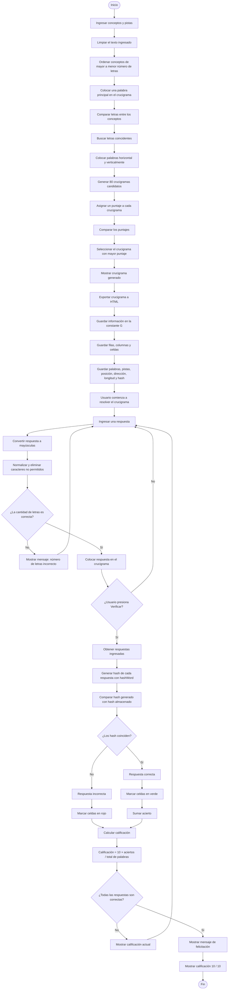

# 1. Nombre de la aplicación
## Generador de Crucigramas Interactivos

Esta aplicación web permite crear, generar, resolver y verificar crucigramas interactivos a partir de conceptos y pistas proporcionados por el usuario.

## 2. Requerimientos para la ejecución

Para utilizar la aplicación, el usuario final debe contar con los siguientes requerimientos:

**Dispositivo:** computadora de escritorio o portátil.

**Sistema operativo:** Windows, Linux o macOS.

**Navegador web:** Google Chrome, Microsoft Edge, Mozilla Firefox, Opera u otro navegador moderno compatible con HTML5, CSS3 y JavaScript.

**JavaScript habilitado:** el navegador debe permitir la ejecución de JavaScript, ya que la generación y verificación de los crucigramas depende de este lenguaje.

**Archivos de la aplicación:** el usuario debe contar con los archivos HTML, CSS y JavaScript correspondientes al sistema.

## 3. Funcionamiento del algoritmo

#### El algoritmo funciona de la siguiente forma:

### 1. Ingreso de conceptos y pistas

Primero, solicita los conceptos junto con las pistas y posteriormente se limpia el texto antes de mostrarlo en la página, de manera que si el usuario escribe caracteres que HTML pueda interpretar como código, se muestren solamente como texto.

### 2. Ordenamiento de los conceptos

Una vez ingresados los conceptos, se ordenan las palabras de mayor a menor número de letras para agregar una de las palabras principales al centro del crucigrama y comparar las letras de todos los conceptos para encontrar similitudes y ordenarlos de manera horizontal y vertical.

### 3. Generación de crucigramas

Se generan 80 crucigramas como posibles candidatos, ya que a cada crucigrama generado se le asigna un puntaje que depende del resultado obtenido durante su generación.

Al finalizar, el crucigrama con el mayor puntaje es el que se presenta para poder exportarlo.

## Exportación y verificación de respuestas

### 4. Almacenamiento del crucigrama

Al exportarlo a HTML, la información del crucigrama se almacena en una constante llamada G, la cual contiene las filas, columnas, celdas y palabras.

Fragmento del código:

```javascript
const G={"filas":11,"columnas":11,"celdas":["0,5","1,5","2,5","3,5","4,5","5,5","6,5","7,5","8,5","9,5","10,5"
```

Dentro de palabras se almacena información como el número de la palabra, pista, posición en X y Y, dirección, longitud y valor hash:

```javascript
{"numero":1,"pista":"hg","x":0,"y":5,"dir":"H","length":11,"hash":482}
```

### 5. Conversión de las respuestas

Al ingresar una respuesta, el sistema la convierte a mayúsculas y elimina determinados caracteres antes de colocarla dentro del crucigrama.

Este proceso se encuentra en la función aceptar():

```javascript
let v=document.getElementById("respuesta").value.toUpperCase().normalize("NFD").replace(/[\u0300-\u036f]/g,"").replace(/[^A-ZÑÜ]/g,"");
```

También se comprueba que la respuesta tenga el número de letras esperado:

```javascript
if(v.length!==G.palabras[actual].length){alert("La palabra debe tener "+G.palabras[actual].length+" letras.");return}
```

### 6. Generación del valor hash

Para realizar la verificación, el programa utiliza la función hashWord(), que recorre los caracteres de la palabra y genera un valor numérico.

Fragmento del código:

```javascript
function hashWord(word){ 
 word=word.toUpperCase(); 
 if(!word.length)return 0; 
 const x=(word.charCodeAt(0)*719)%1138; 
 let hash=837; 
 for(let i=1;i<=word.length;i++)hash=(hash*i+5+(word.charCodeAt(i-1)-64)*x)%98503; 
 return hash; 
}
```

### 7. Verificación de las respuestas

Cuando el usuario presiona el botón para verificar el crucigrama, el sistema compara el valor generado por hashWord() con el hash almacenado en la palabra.

Esta comparación aparece directamente en el código:

```javascript
const ok=hashWord(respuestas[i])===p.hash;
```

Si los valores coinciden, la respuesta se considera correcta; de lo contrario, se considera incorrecta.

Los aciertos se irán sumando hasta que todas las respuestas sean correctas.

### 8. Respuestas correctas e incorrectas

Si la respuesta es incorrecta, las celdas correspondientes se muestran en rojo. Si la respuesta es correcta, se muestran en verde.

El código utiliza las clases correcta e incorrecta:

```javascript
document.getElementById("c"+xx+"_"+yy).classList.add(ok?"correcta":"incorrecta");
```

En caso de que la respuesta tenga menos o más letras de las esperadas, el sistema muestra un mensaje indicando que no cumple con el número de letras requerido.

### 9. Cálculo de la calificación

El programa calcula una calificación dependiendo de la cantidad de respuestas correctas.

En el código se realiza mediante:

```javascript
const cal=(10*ac/G.palabras.length).toFixed(1);
```

De esta manera, el puntaje irá aumentando conforme el usuario responda correctamente las palabras.

### 10. Finalización del crucigrama

Al terminar de responder correctamente todo el crucigrama, el sistema muestra un mensaje de felicitación.

Este comportamiento se encuentra en:

```javascript
if(ac===G.palabras.length){ 
  resultado.className="felicitacion"; 
  resultado.innerHTML="🎉 ¡Felicidades!<br><small>Completaste correctamente todo el crucigrama. Calificación: 10 / 10</small>";
}
```

De esta manera, cuando todas las respuestas son correctas, el usuario obtiene una calificación de **10/10** y recibe el mensaje de felicitación.

## 4. Diagrama de flujo del Generador de Crucigramas


